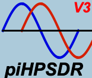

**SDR host program**,
supporting both the old (P1) and new (P2) HPSDR protocols, as well as the SoapySDR framework.
It runs on Linux (Raspberry Pi but also Desktop or Laptop computers running LINUX) and MacOS (Intel or AppleSilicon CPUs, using  "Homebrew" or "MacPorts").

**piHPSDR Manual (PDF file, about 300 pages) for release versions:**

**v2.4:** https://github.com/dl1ycf/pihpsdr/releases/download/v2.5/piHPSDR-Manual-v2.4.pdf

**v2.5:** https://github.com/dl1ycf/pihpsdr/releases/download/v2.5/piHPSDR-Manual-v2.5.pdf

**v2.6:** https://github.com/dl1ycf/pihpsdr/releases/download/v2.5/piHPSDR-Manual-v2.6.pdf

**A manual for the current master branch is updated from time to time here:**

https://github.com/dl1ycf/pihpsdr/releases/download/v2.5/piHPSDR-Manual.pdf

***
piHPSDR should be compiled from the sources, consult the Manual (**link given above**) on how to compile/install piHPSDR on your machine
***

Latest features:

- Selectable color themes
- more complete TCI implementation including TCI-Audio
- DX cluster support
- Reduced client/server bandwidth due to data compression
- different selectable CW audio peak filters
- storing/restoring RX and TX profiles in individual (user-selectable) slots
- manual multi notch filter (in the FILTER menu)
- NR3/NR4 noise reduction models (RNNnoise and libspecbleach) fully integrated
- client/server model for remote operation (including transmitting in phone and CW)
- fully configurable Slider and Toolbar area
- added continuous frequency compressor (**CFC**) and downward expander (**DEXP**) to the TX chain
- audio recording (RX capture) and playback (TX)

